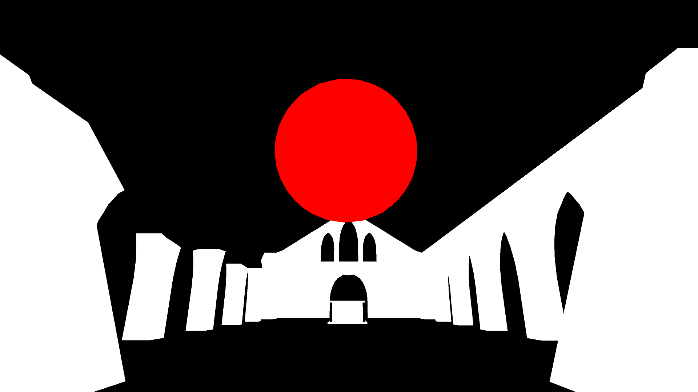
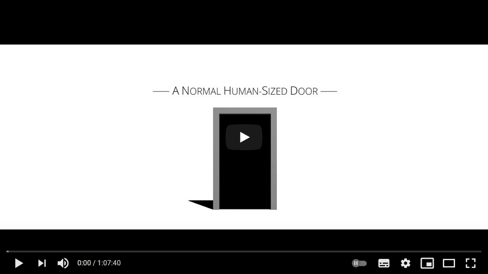

# Black and Secret Places

A Unity project where we're going to take turns streaming audio development using [Pure Data](https://puredata.info/) and the [LibPdIntegration](https://github.com/LibPdIntegration/LibPdIntegration) Unity wrapper.

You can view our streams on [this playlist](https://www.youtube.com/playlist?list=PL9mtAkCrEZavP0T_C4mLqKdxYD-4wURoZ), and if you want to follow along at home there are releases for each stage of the project, on the [releases page](https://github.com/NiallMoody/black-and-secret-places/releases).